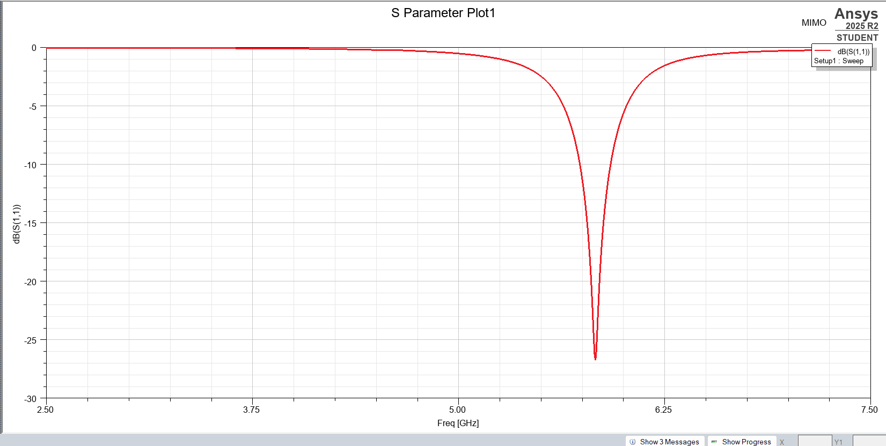
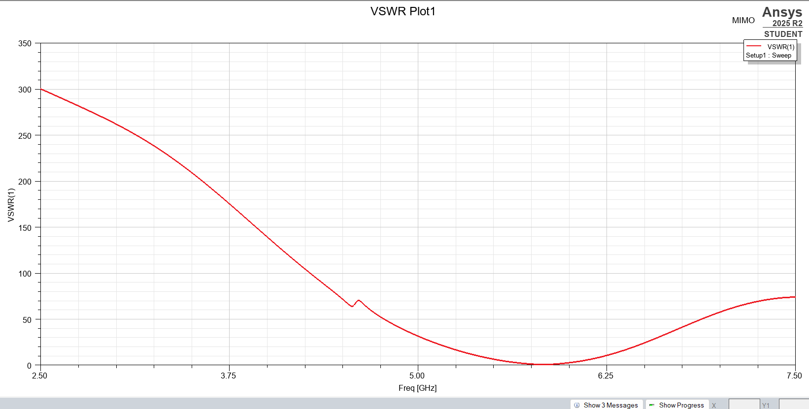
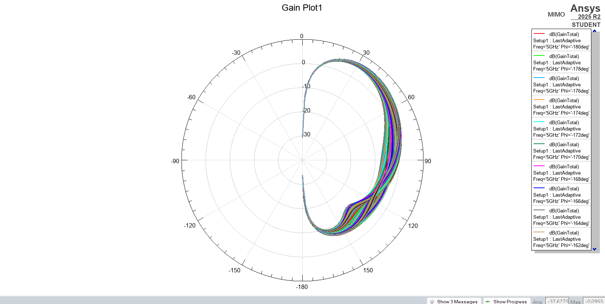

# 2x2 Rectangular Patch Antenna Array

## Overview
This directory contains the Ansys HFSS files for a 4-element ($2 \times 2$) Rectangular Patch Antenna Array. By arranging multiple radiating patches into an array and using a corporate feed network, this design significantly increases the overall directivity and gain compared to a single patch element.

## Design Specifications
* **Target Frequency:** 5Ghz
* **Substrate Material:** Rogers
* **Dielectric Constant (ε_r):** 2.2
* **Array Configuration:** 2x2 Planar Array
* **Feed Type:** Corporate microstrip feed network

## Key Results
S-Parameter (S11) Plot:

VSWR Plot:

Gain/Radiation Pattern Plot:

## How to Use
Open the `.aedt` file in Ansys HFSS. Pay special attention to the feed network power division and impedance matching at the T-junctions.
