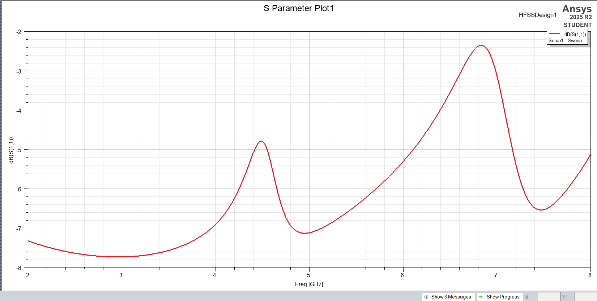
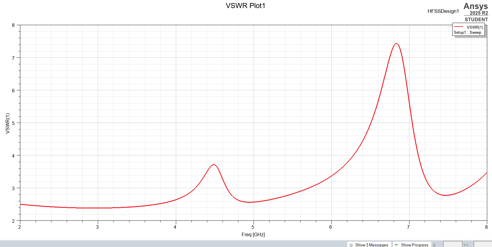
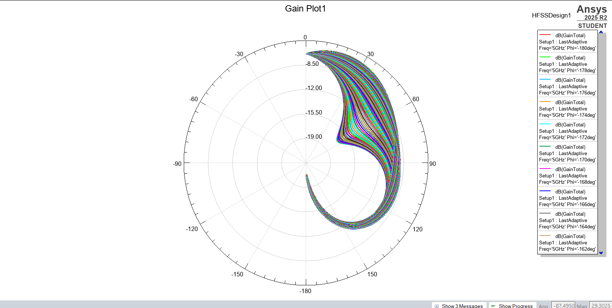

# Cylindrical Dielectric Resonator Antenna (DRA)

## Overview
This directory contains the Ansys HFSS files for a Cylindrical Dielectric Resonator Antenna (DRA) (or cylindrical monopole, depending on the exact material properties used in your model). DRAs offer high radiation efficiency due to the absence of conductor losses, making them highly effective at millimeter-wave frequencies.

## Design Specifications
* **Target Frequency:** 5Ghz
* **Substrate Material:** FR4
* **Resonator Material / Dielectric Constant:** 4.4
* **Cylinder Dimensions:** 1.6mm, 5mm
* **Feed Type:** [e.g., Probe feed, aperture coupling, or microstrip line]

## Key Results
Below are the simulation plots for this design:

S-Parameter (S11) Plot:

VSWR Plot:

Gain Plot:

## How to Use
Open the `.aedt` file in Ansys HFSS to inspect the 3D geometry of the resonator, the material assignments, and the specific feed mechanism used to excite the DRA modes.
