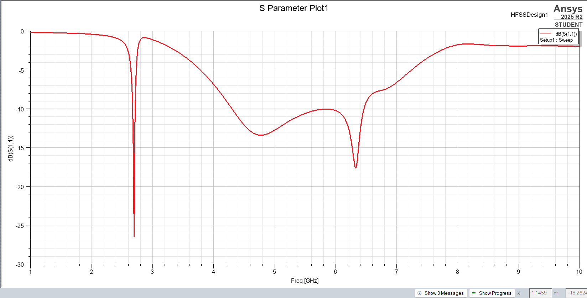
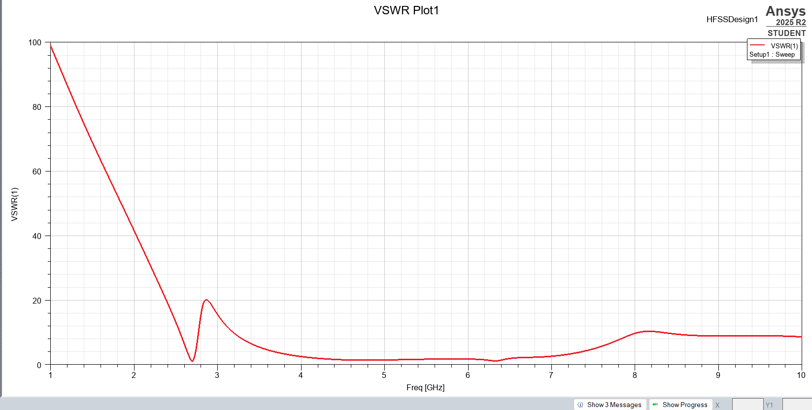
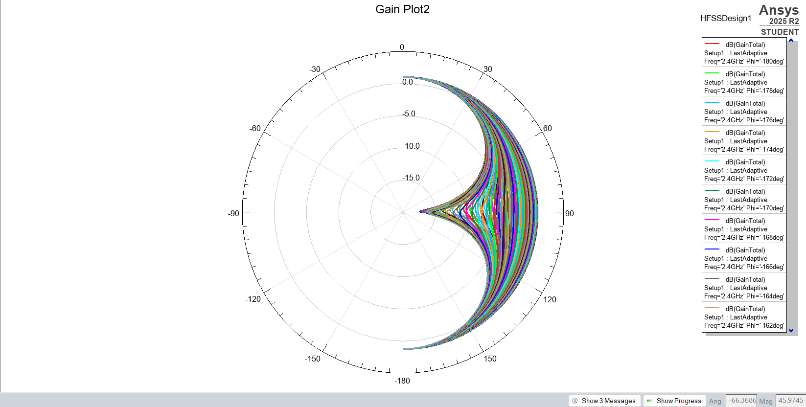

# Slotted Ring Patch Antenna

## Overview
This directory contains the Ansys HFSS design files for a Slotted Ring (Circular) Patch Antenna with symmetric outer stubs. This complex planar geometry is typically designed to achieve multiband resonance or wideband characteristics, making it suitable for modern wireless communication systems requiring multiple operating frequencies.

## Design Specifications
* **Target Frequencies:** 2.4Ghz
* **Substrate Material:** FR4_epoxy
* **Dielectric Constant (ε_r):** 4.4
* **Substrate Thickness:** 1.6mm
* **Feed Type:** Microstrip line feed

## Key Results
Below are the simulation plots for this design:

S-Parameter (S11) Plot:

VSWR Plot:

Gain Plot:

## How to Use
Open the `.aedt` file in Ansys Electronics Desktop (HFSS) to explore the geometry, mesh settings, and parameter sweeps.
