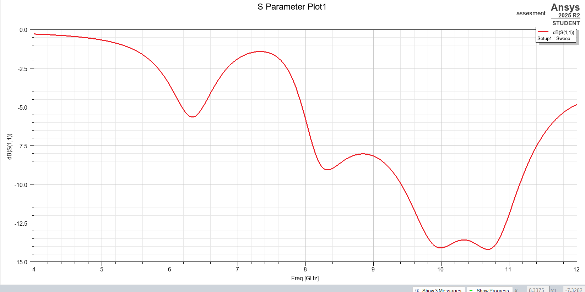
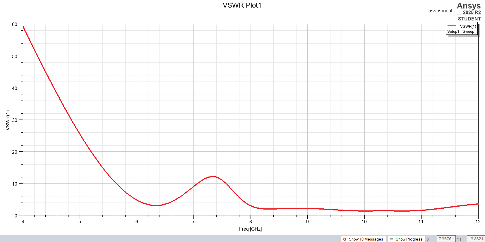
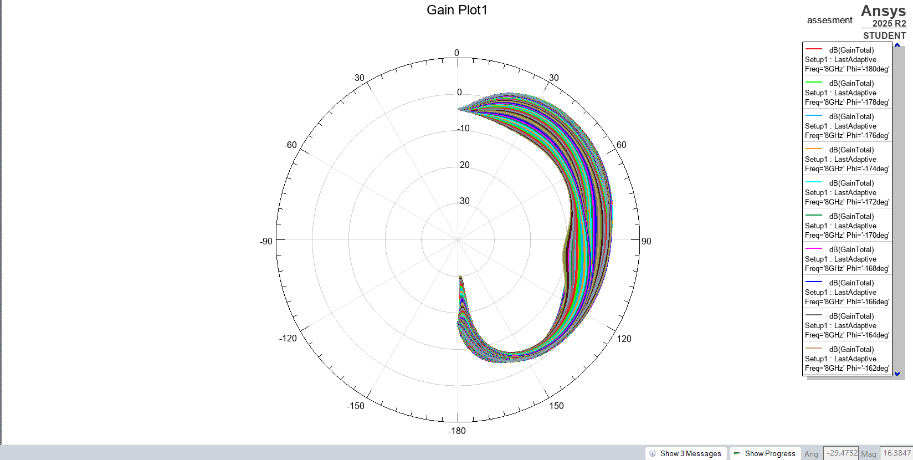

# U-Slot Rectangular Patch Antenna

## Overview
This directory contains the Ansys HFSS simulation files for a Rectangular Microstrip Patch Antenna featuring a U-shaped slot. Introducing a U-slot on the radiating patch alters the surface current distribution, making this design highly effective for dual-band operation or significant bandwidth enhancement compared to a standard patch.

## Design Specifications
* **Target Frequency:** 8Ghz
* **Substrate Material:** Rogers
* **Dielectric Constant (ε_r):** 2.33
* **Substrate Thickness:** 3.175mm
* **Feed Type:** Microstrip line feed

## Key Results
Below are the simulation plots for this design:

S-Parameter (S11) Plot:

VSWR Plot:

Gain Plot:

## How to Use
Open the `.aedt` file in Ansys Electronics Desktop (HFSS) to view the 3D model, boundary conditions, excitations, and result plots.
